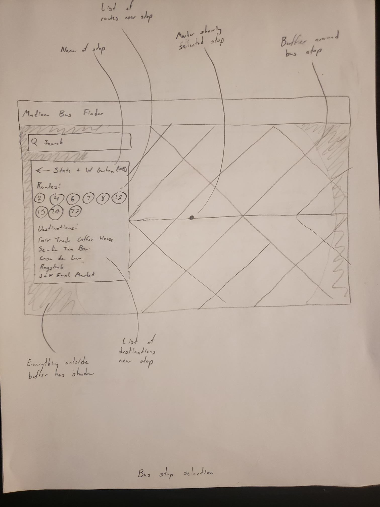

575 Project Proposal
Group: Tristan Mills, Jacob Yurek, Chun Pong Brian Chan
Application Overview: 
Mapping transit frequency and access for bus routes in Madison. This interactive map would allow users to select bus routes, places within a certain walking distance of each bus stop for that route, and how long it takes to travel between the starting point and destination.
The interactive map will display an initial map containing all Madison bus routes as a reference for users to find the bus route they want to take. On top of the map, there will be a menu displaying a list of the bus routes, allowing the user to select the route they want to explore. Below the title bar, on the top left corner of the map, there will be a search bar allowing the user to search for a destination and will highlight the nearest bus stops and the routes serving those stops.
A list of all the bus routes and their associated colors will be displayed below the search bar on the map. Users can select from “Weekday”, “Weekend”, and “Holiday”, and will highlight the available routes for the corresponding days. For example, someone who wants to ride the bus on Tuesday can select “Weekday”, but if they want to ride on Sunday, they can select “Weekend”. When the user clicks on an available bus route, the map will zoom to the appropriate scale providing a full view of the route. Along the route, the map will display a map of all the bus stops within that route, which the user can click on. Clicking a bus stop on the map will zoom in and display a .25 mi buffer of all important destinations within the 25 mi buffer surrounding the bus stop.

Target User Profile (Persona):
Name and Position: 
Joseph Joestar, UW Health healthcare social worker.
Background Description: 
Joseph is an employee at UW Health whose main responsibility is to interact with patients and assist them with their healthcare needs. His patients have a variety of appointments at many UW Health locations throughout the Madison area. Coordination of the patient’s care involves planning their means of transport, and many of Joseph's clients do not own cars. As such, Joseph needs a means of showing his patients bus routes to their appointment locations, and his patients will then need to be able to utilize this on their own as well. Joseph has some familiarity with the madison bus routes and how to utilize online map applications. The current paper map of bus routes is very complicated and limited in scope, which makes it difficult for Joseph and his patients to identify optimal bus routes. Being able to filter out information that does not pertain to his clients time availability or schedule would benefit his goal of client satisfaction and ease of care. The clients schedule is their primary concern and therefore their ability to compare commute and departure times is their primary goal.
Beyond his workplace usage of the app, Joseph also travels throughout Madison during his non-work time. He would like to be able to use the app to plan his various outings, but also find interesting locations along the bus routes. This could include local restaurants, parks, shops, and tourist locations. 

Use case scenarios:

Scenario #1
	The user opens the app and is greeted by the query menu. This menu is designed to overcome user inexperience and prevent an observed breakdown of goals. It first asks the user to input whether the planned day of travel is a weekday, weekend, or holiday. It will then enable the input of the destination location along with current location and departure time. This search box feature enables the user to identify possible bus routes that travel to this selected location, along with information about bus stop locations and departure times from said bus stops. This also filters out many of the bus routes not relevant to the user, making identification easier. With the location imputed, the selected routes will be overlaid on the basemap. The user will be able to sequence through the results panel to explore the various routes and retrieve the basic route information. This will enable the user to compare between multiple bus routes to see which one best conforms to their desires. After comparing the 7 and the 2 bus routes, the user decides the 7 has a better schedule for their appointments. The user can then use the pan and zoom functions to explore the basemap along the bus route and its various stops. By hovering over various locations the user can retrieve information on the location.

Requirements Document:
Representation:
Basemap: The outline of the Madison map
Routes: Highlighted the shortest bus routes
Legend: Options of “weekday”, “weekend”, and “holidays” 
Menu: A list of routes of all the bus routes
Timeline: The average time it takes for the bus to get to a specific location
Box: The input of a desired bus route.
Overview: Documentation on the user guideline

Interaction:
Query Panel: Filter, the bus routes and time, Adjustment for the initial parameters (e.g. start, destination, weekdays)
Result Panel: Retrieve, the shortest highlighted route.
	           Reexpress, Map visual hierarchy changes to show preferred route
Sequence: Result changes based on chosen route, location, overall time required
Route Selection: Retrieve, Select from the pull-down menu.
Hover: Resymbolize, preferred or selected routes turn highlighted.
	Retrieve: hover over the name to get the nearby places information

Lo-fi Wireframes
Wireframes:

